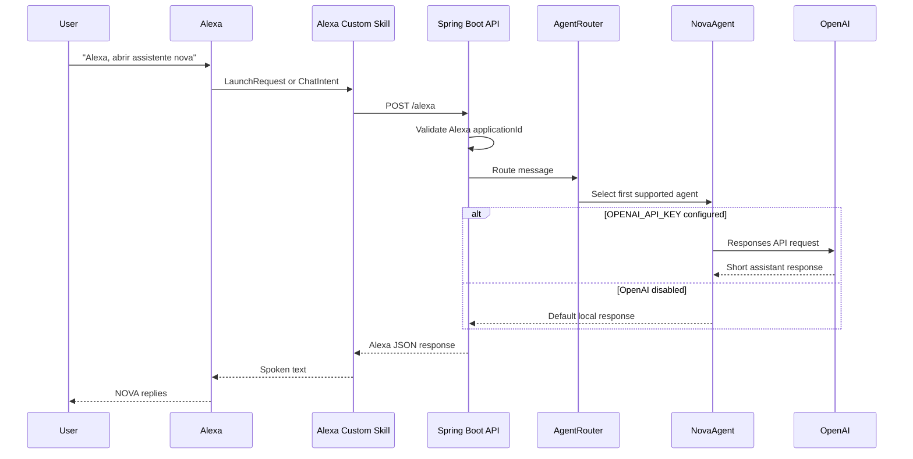

# NOVA Assistant

NOVA is an Alexa Custom Skill backed by a Spring Boot service. Alexa handles the
voice interface, while this backend owns the conversation flow, safety checks,
agent routing, and optional OpenAI integration.

## Current Flow



## Architecture

```text
Alexa
  -> AlexaController
  -> NovaService
  -> AgentRouter
  -> NovaAgent implementation
  -> OpenAI, when configured
```

Main components:

- `AlexaController`: receives Alexa requests and maps request types/intents.
- `AlexaResponseFactory`: builds the minimal JSON response Alexa expects.
- `NovaService`: owns high-level assistant behavior.
- `AgentRouter`: selects the first agent that supports the message.
- `DefaultAgent`: safe fallback when OpenAI is not configured.
- `OpenAiAgent`: calls OpenAI only when `OPENAI_API_KEY` is available.
- `OpenAiUsageLimiter`: in-memory guard against accidental excessive usage.
- `HealthController`: exposes `/health` for Render health checks.

## Requirements

- Java 21
- Maven Wrapper included in the repository
- Docker for Render deployment
- Alexa Developer Console custom skill
- Optional: OpenAI API key

## Local Development

Run tests:

```powershell
.\mvnw.cmd test
```

Run locally:

```powershell
.\mvnw.cmd spring-boot:run
```

Health check:

```text
GET http://localhost:8080/health
```

Alexa endpoint:

```text
POST http://localhost:8080/alexa
```

## Environment Variables

Required for production-like Alexa validation:

```text
NOVA_ALEXA_APPLICATION_ID=amzn1.ask.skill.your-skill-id
```

Optional OpenAI configuration:

```text
OPENAI_API_KEY=sk-...
OPENAI_MODEL=gpt-5-nano
OPENAI_MAX_INPUT_CHARS=800
OPENAI_MAX_OUTPUT_TOKENS=160
OPENAI_REASONING_EFFORT=minimal
OPENAI_TEXT_VERBOSITY=low
OPENAI_MAX_REQUESTS_PER_WINDOW=20
OPENAI_RATE_LIMIT_WINDOW_MINUTES=60
```

If `OPENAI_API_KEY` is missing, NOVA still runs and uses `DefaultAgent`.

## Security Notes

- Never commit API keys or secrets.
- Store `OPENAI_API_KEY` in Render environment variables.
- Store `NOVA_ALEXA_APPLICATION_ID` in Render environment variables.
- The backend rejects Alexa requests from other skill ids when the expected
  application id is configured.
- User messages are not logged by the Alexa controller.
- OpenAI responses are requested with `store=false`.
- The local request limiter is a safety guard, not a billing guarantee. Configure
  account-level API budgets in the OpenAI dashboard.

## Render Deployment

This repository includes:

- `Dockerfile`
- `render.yaml`
- `/health` endpoint

Render should deploy the Docker service and use:

```text
https://your-render-service.onrender.com/alexa
```

In the Alexa Developer Console endpoint settings, use the wildcard certificate
option for Render subdomains:

```text
My development endpoint is a sub-domain of a domain that has a wildcard certificate from a certificate authority
```

## Alexa Skill Setup

Current skill shape:

- Locale: Portuguese (Brazil)
- Invocation name: `assistente nova`
- Intent: `ChatIntent`
- Slot: `mensagem`
- Slot type: `AMAZON.SearchQuery`

Sample utterances:

```text
pergunte {mensagem}
me explique {mensagem}
quero saber {mensagem}
me fale sobre {mensagem}
pesquise {mensagem}
```

The skill can be tested privately in development mode. It does not need to be
published for testing on devices linked to the same Amazon developer account.

## Testing Strategy

Tests should cover:

- Alexa request handling
- Alexa response JSON shape
- Local service behavior
- Agent routing
- Usage limit behavior

Tests should not call OpenAI directly. OpenAI integration is exercised through
local boundaries and fallback behavior.

## Next Steps

- Add specialized agents such as `ProgrammingAgent` and `LanguageTeacherAgent`.
- Add session/context storage when conversational memory is needed.
- Add stronger rate limiting backed by persistent storage if the service grows.
- Add structured request validation for Alexa signatures before public release.
